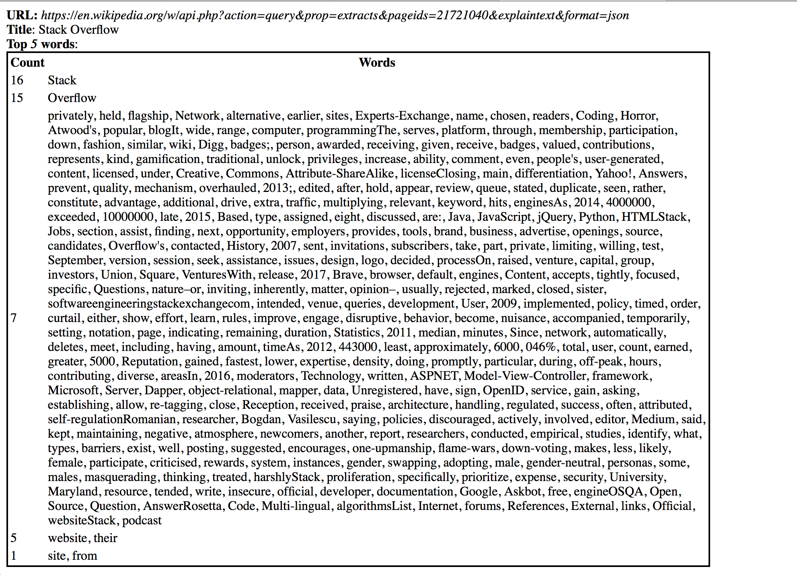

# wiki_top_search 
 

Finds the top N words by count on wikipedia

## Dependency 
    $ pipenv install requests
    $ pipenv install six
    $ pipenv install flask

### How to test it
    $ export FLASK_APP=main.py
    $ flask run
  
Then with a browser open http://127.0.0.1:5000/v1/getinfo/21721040/5/

